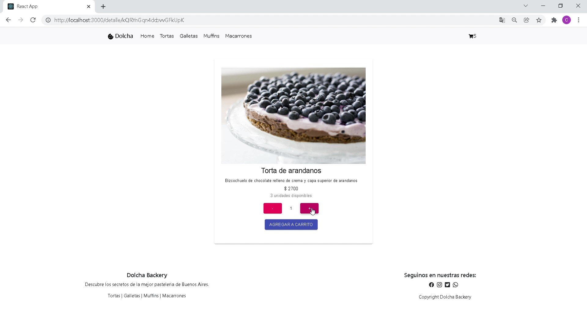

# Dolcha Backery Ecommerce

Este proyecto fue creado con React. [Create React App](https://github.com/facebook/create-react-app).



## Dependencias y Funciones

Para este proyecto se utilizaron las siguientes dependencias:

### React Bootstrap

### `npm install react-bootstrap bootstrap@5.1.3`

Se utilizó la librería React Bootstrap para crear el Navbar. Lo que lo convierte en una excelente opcion en la interfaz de usuario permitiendo navegar a traves de él en las distintas categorías.

### React Icons

### `npm install react-icons --save`

Para todos los iconos se utilizó React Icons que por su practicidad permitio que se pudieran adaptar de manera consistente con el estilo de la aplicacion.

### Material-UI

### `npm install @material-ui/core`

Para el desarrollo de las carateristicas interactivas, se utilizó Material-UI. Material-UI es un libreria que permitió dinamismo con un diseño atractivo e intuitivo reflejado en todas las secciones de la aplicación.

### Sweetalert2

### `npm install sweetalert2`

Para el desarrollo de alertas se utilizó la libreria Sweetalert que permite mostrar los mensajes al usuario de manera sencilla y con un diseño agradable a la vista.

### Firebase

### `npm install firebase`

Firebase se utilizó como sincronizador de datos, permitiendo tener acceso a una base de datos en tiempo real y generando un codigo identificador por cada compra de generada en la aplciación. 


## Como descargar el sitio desde Github

Para descargar el sitio desde Github debe realizar los siguientes pasos:

1. Desde la terminal escribir el siguiente comando:

```
git clone https://github.com/ClaudiaSimonetti/dolcha.git
```
2. Luego, instalar las dependencias con:
```
npm install
```
3. Para poder navegar dentro de la aplicacion deberá escribir el siguiente comando:
```
npm start
```

## Acceso al sitio desde la URL

Aquí podras acceder en forma directa a la pagina [Dolcha Backery](https://claudiasimonetti.github.io/dolcha/)